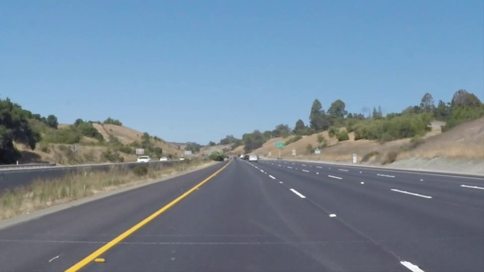
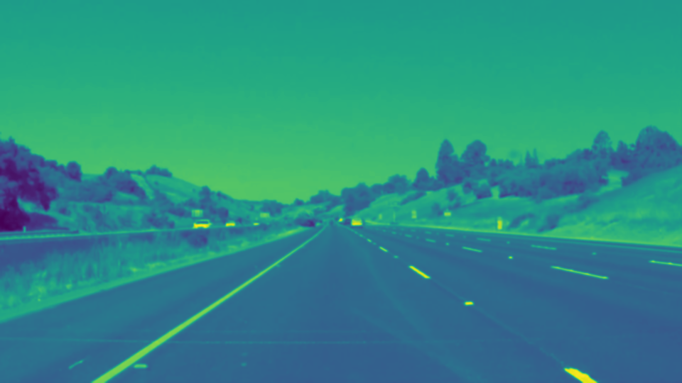
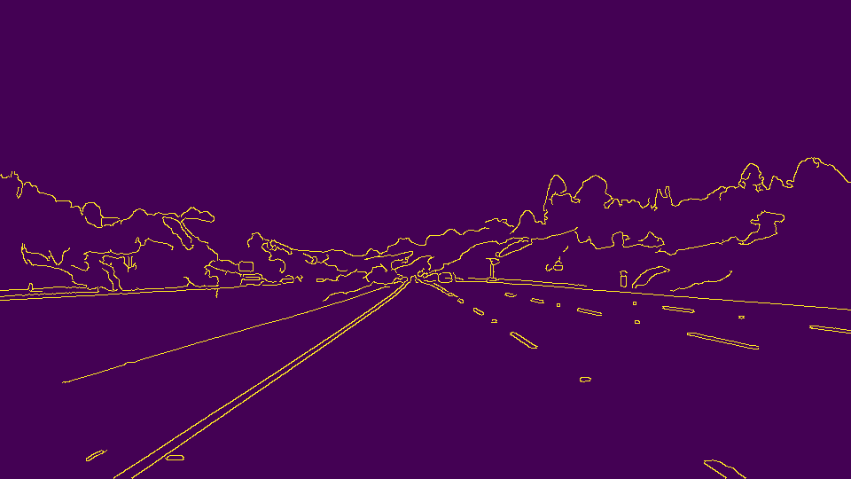
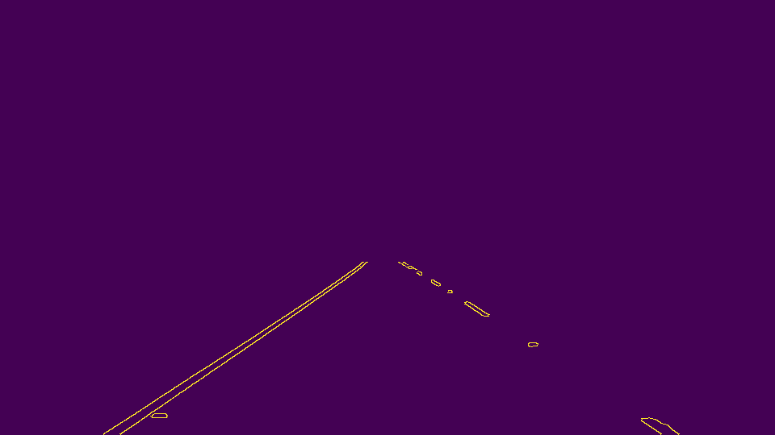
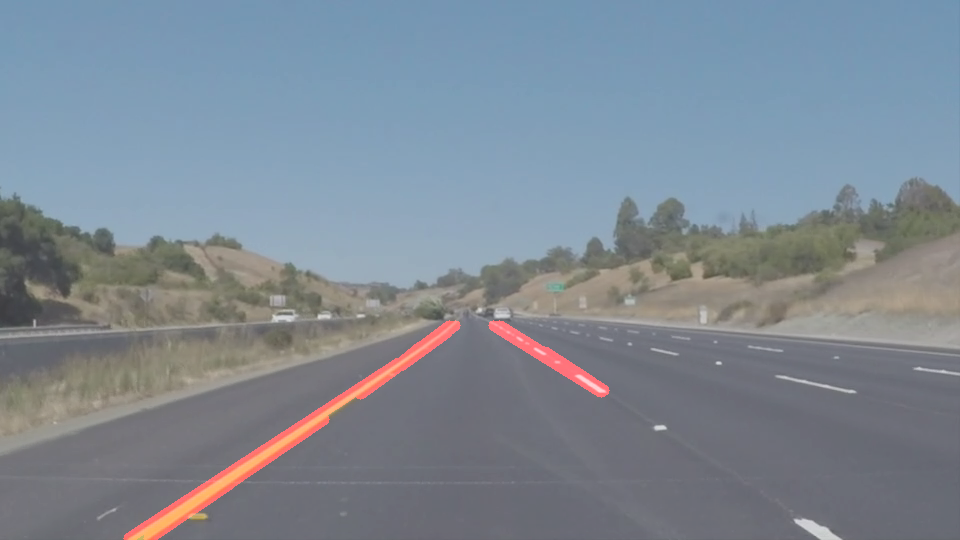
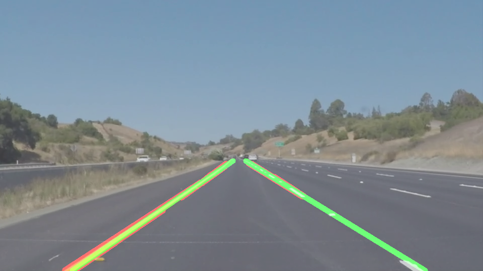

# **Finding Lane Lines on the Road** 

**Finding Lane Lines on the Road**

The goals / steps of this project are the following:
* Make a pipeline that finds lane lines on the road
* Reflect on your work in a written report

[//]: # (Image References)

[image1]: ./examples/grayscale.jpg "Grayscale"

---

### Reflection

### 1. Describe your pipeline. As part of the description, explain how you modified the draw_lines() function.

My pipeline consisted of 5 steps. 

Start from original image as below.

#### 1. Convert image as Gray scale and apply Gausiaan smoothing with `cv2.GaussianBlur`
For better outcome, make image smoother with Gaussian filer. So that, I could decrease noises.
- Configuration : kernel_size = 5

#### 2. Edge detection wih `cv2.Canny`
With Canny edge detection, find out all edges from the image.
- Configuration : low threshold = 30, high threshold = 150

#### 3. Set makred region with `cv2.fillPoly` and `cv2.bitwise_and`
Set interested-region where the driving line can be detected. I set region as squre shape
- Image size = (540, 960)
- Apex of sqaure : left up = (430, 325), left botton =(80, 540), right up = (430, 325), right bottom = (920, 540)

#### 4. Fine lanes with `cv2.HoughLinesP` 
Find out whole lines from the image
- configuration : rho = 2, theta = 1 radian, threshold = 15, min line length = 40, max line gap = 20

#### 5. Draw extrapolated line for left/right with `np.polyfit`

##### 5-1. Remove founded lines which are not driving lines definately
From the founded lines, calulate the slope. If the slope is between -0.4~0.3, do not consider these line. Slope in this range is almost right-angled with the driving direction. Thus, those lines are not driving line with high possibilities.

##### 5-2. Divide founded lines from Hough between LeftLane and RightLane
From the calulated slope, consider positive slope as left line and negative slope as right line

##### 5-3. Determin one single line
Based on the filtered lines for each lane, apply `np.polyfit` to find single representative line

### 2. Identify potential shortcomings with your current pipeline

#### 1. Line is located out of marked region
One potential shortcoming would be what would happen when any of left or right line is not detected from masked region. 
Since driver don't always follow middle of driving lanes, somethine masked region cannot cover the car lines at some time. 

#### 2. Detected line is not smoothly changed between several frames
Another shortcoming could be vibration of detected lines. If the lines are not detected smoothly from the video, then "driving direction" based on these detected lines will not be smooth, either. This can cause vibration to drivers during auto-driving.

### 3. Suggest possible improvements to your pipeline

Here are possible improvements for each shortcoming in above:

#### 1. Using lane from previous frame or implementation dynamic region marking
When line is not detected from region area, it can be fingured out by checking dimension of "leftArr" and "rightArr" from my code. After HoughTransform, output lanes shall be saved at each array based on the calulated slope. Thus if the dimension of array is not 2 (= empty), it means that the left or right or both are not detected in this frame. In this case, error log shall be printed. In this case, it would be better that we use lanes which were founded from previous frame. Or we can enlarge maked region dynamically during code is running only for these cases. 

#### 2. More elaborate tuning on config for OpenCV functions or adding filter at the last stage
To make smooth change of detected lane between several frames, the configurations of functions can be tuned more elaborately. So, decrease noise and find lines more effectively. Or in the real auto-driving, the driving direction would be middle of two detected lines. So at the last minute, when we decide driving direction, we can apply one more filter to make chaning smoothly. But at the same time, I have concern about delay which can be caused by this filter.
